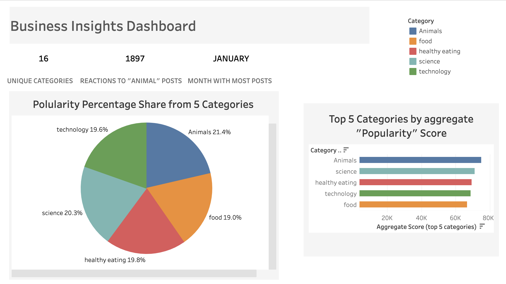

# Social Buzz — Top 5 Content Categories (Data Analytics Case Study)

**Business Conclusion (One-liner):**  
Users show the highest engagement with "Animals" and "Science" content, while "Healthy Eating" reveals strong monetization potential, I recommend prioritizing personalized recommendations and targeted partnerships in these categories.



**Interactive Dashboard:** [View on Tableau Public]([PLACEHOLDER_TABLEAU_PAGE_LINK])

---

## Table of Contents
- [Business Background](#business-background)
- [Data & Cleaning](#data--cleaning)
- [Methodology](#methodology)
- [Key Insights](#key-insights)
- [How to Reproduce](#how-to-reproduce)
- [Repository Structure](#repository-structure)
- [Contact](#contact)

---

## Business Background
Social Buzz, a fast-growing unicorn social media platform, receives over **100,000 posts/day** (~36.5M/year) of unstructured content.  
Our task: **Identify the top 5 most engaging content categories** and provide business recommendations for growth and monetization.

---

## Data & Cleaning
- Original dataset: confidential client data (sample anonymized dataset provided in `/data/sample_posts.csv`)
- Fields included: `post_id`, `created_at`, `category`, `reactions`, `shares`, `comments`, `text`
- Cleaning process:
  - Removed duplicates  
  - Standardized timezones  
  - Mapped 16 raw categories to consolidated categories  
  - Defined **Popularity Score** = weighted sum of reactions, shares, and comments

---

## Methodology
1. **Data Understanding** — reviewed business model, category taxonomy, and engagement KPIs  
2. **Data Cleaning** — standardized formats, removed outliers, mapped categories  
3. **Data Modeling** — computed popularity score per category  
4. **Data Analysis** — identified seasonal posting trends & top 5 categories  
5. **Data Visualization** — designed an interactive Tableau dashboard for executives

---

## Key Insights
- **Top 5 Categories:** Animals, Science, Healthy Eating, Technology, Food  
- Animals lead with a **Popularity Score ~74,965**, **1.1% ahead** of Science — a notable lead worth monitoring  
- Food-related content appears twice (Healthy Eating + Food), suggesting strong audience interest in food topics  
- Healthy Eating posts show **higher engagement per post**, indicating strong targeting and monetization potential  
- January shows the highest posting frequency — aligns with post-holiday social reconnection trends

---

## How to Reproduce
```bash
# Clone the repository
git clone [PLACEHOLDER_GITHUB_REPO_LINK]
cd social-buzz-top5-content

# Create and activate environment
conda env create -f environment.yml
conda activate social-buzz

# Run analysis
jupyter lab
